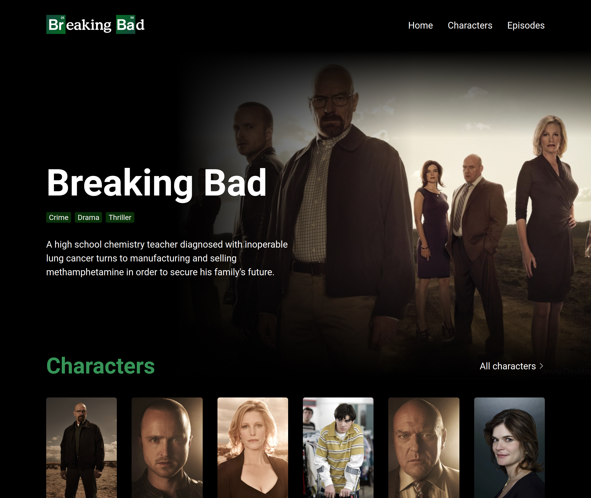

# Breaking Bad Wiki

> Application for fans of the Breaking Bad series. List of characters, seasons and episodes in one place.

> Live demo [https://jakubparlej.github.io/breaking-bad-api/](https://jakubparlej.github.io/breaking-bad-api/).

## Table of Contents

- [General info](#general-info)
- [Technologies](#technologies)
- [Features](#features)

## General info

This projects is created with React and it uses [Breaking Bad API](https://breakingbadapi.com/). With this app user can find characters & info about them, list of seasons and list of episodes.

## Technologies

Project is created with:

- React
- Styled components
- [Breaking Bad API](https://breakingbadapi.com/)

## Features

- page with list of characters
- pages with informations about each characters
- page with list of seasons and episodes

## Contact

Created by [@jakubparlej](https://jprojects.pl) - feel free to contact me!
